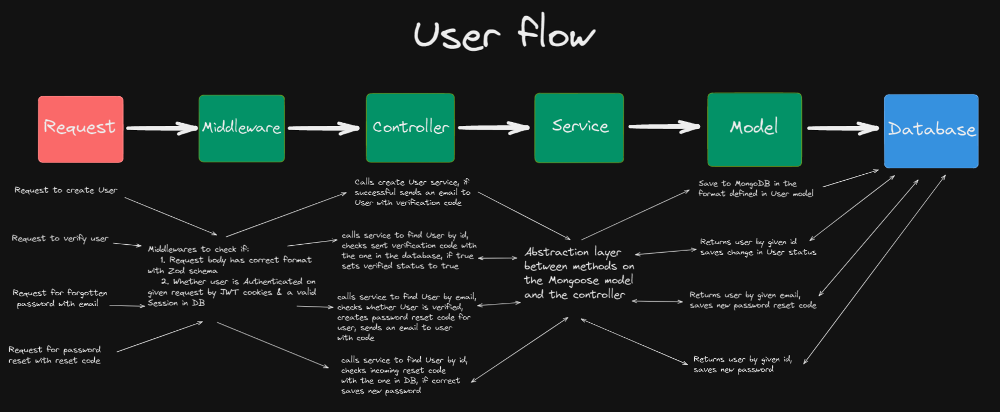

# Backend-only user authentication API

Simple Backend-only REST API for basic user authentication flow.

## Demo

## Features

- Node/Express REST API/User authentication architecture
- Login/Register user, authenticate/refresh user session with JWT tokens, get current user, validate email, reset password

## Tech Stack

**Server**: Typescript, Node.js, Express.js, REST API, MongoDB, Mongoose, JWT, Nodemailer, Zod

## Lessons Learned

Clean and scalabe backend REST API + basic user authentication architecture, usage of JSON webtokens, express middlewares, input validation with Zod, MongoDB with Mongoose...

WORK IN PROGRESS

### -

Credit goes to TomDoesTech on youtube for the original idea & architecture.
